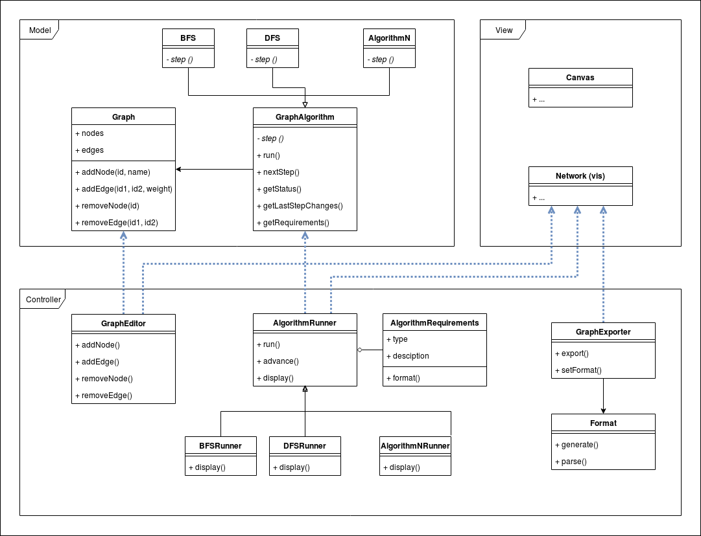

# Diseño

Una primera version del modelo es la siguiente:

##### Caracteristicas:
* Para agregar un algoritmo, bastaria con agregar su correspondiente logica en el modelo y forma de mostrarlo en la vista, modificando la Network.
* Para permitir un nuevo formato de exportacion/importacion, se debe agregar un nuevo objeto con la forma parseo de la Network correspondiente. Aun no esta muy claro si debe interactuar con el grafo del modelo.

